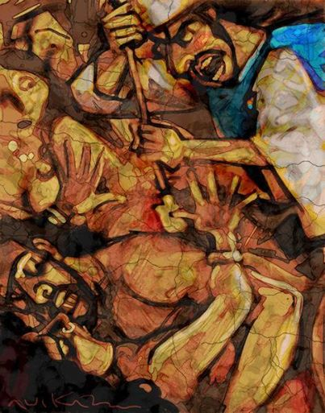

##經文：民數記 廿五章1-18節

1. 以色列人住在什亭，百姓與摩押女子行起淫亂。
2. 因為這女子叫百姓來，一同給他們的神獻祭，百姓就吃他們的祭物，跪拜他們的神。
3. 以色列人與巴力毘珥連合，耶和華的怒氣就向以色列人發作。
4. 耶和華吩咐摩西說：將百姓中所有的族長在我面前對著日頭懸掛，使我向以色列人所發的怒氣可以消了。
5. 於是摩西吩咐以色列的審判官說：凡屬你們的人，有與巴力毘珥連合的，你們各人要把他們殺了。
6. 摩西和以色列全會眾正在會幕門前哭泣的時候，誰知，有以色列中的一個人，當他們眼前，帶著一個米甸女人到他弟兄那裡去。
7. 祭司亞倫的孫子，以利亞撒的兒子非尼哈看見了，就從會中起來，手裡拿著槍，
8. 跟隨那以色列人進亭子裡去，便將以色列人和那女人由腹中刺透。這樣，在以色列人中瘟疫就止息了。
9. 那時遭瘟疫死的，有二萬四千人。
10. 耶和華曉諭摩西說：
11. 祭司亞倫的孫子，以利亞撒的兒子非尼哈，使我向以色列人所發的怒消了；因他在他們中間，以我的忌邪為心，使我不在忌邪中把他們除滅。
12. 因此，你要說：我將我平安的約賜給他。
13. 這約要給他和他的後裔，作為永遠當祭司職任的約；因他為神有忌邪的心，為以色列人贖罪。
14. 那與米甸女人一同被殺的以色列人，名叫心利，是撒路的兒子，是西緬一個宗族的首領。
15. 那被殺的米甸女人，名叫哥斯比，是蘇珥的女兒；這蘇珥是米甸一個宗族的首領。
16. 耶和華曉諭摩西說：
17. 你要擾害米甸人，擊殺他們；
18. 因為他們用詭計擾害你們，在毘珥的事上和他們的姊妹、米甸首領的女兒哥斯比的事上，用這詭計誘惑了你們；這哥斯比，當瘟疫流行的日子，因毘珥的事被殺了。

> 大綱：
> 1. 罪得勝利 (1-5)
> -- 淫亂+拜偶像, 怒氣
> 2. 贖罪之舉 (6-18) 
> -- 公然犯罪, 贖罪
> 3. 新約的身影
> 4. 世界的引誘
> -- 沒關係… , 拜偶像和姦淫 

### 小組討論：
1. 透過經文，你對罪有什麼新的認識或是提醒？
2. 你有確信，你已經被贖罪了嗎？為什麼？
3. 有哪些”罪”是你看到周遭的基督徒容易感覺沒關係的？又有那些罪是你容易陷入”沒關係”的試探？

