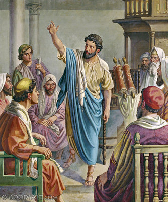

##經文：使徒行傳九章19-30節

19. 吃過飯就健壯了。掃羅和大馬色的門徒同住了些日子，
20. 就在各會堂裡宣傳耶穌，說他是神的兒子。
21. 凡聽見的人都驚奇，說：在耶路撒冷殘害求告這名的，不是這人嗎？並且他到這裡來，特要捆綁他們，帶到祭司長那裡。
22. 但掃羅越發有能力，駁倒住大馬色的猶太人，證明耶穌是基督。
23. 過了好些日子，猶太人商議要殺掃羅，
24. 但他們的計謀被掃羅知道了。他們又晝夜在城門守候，要殺他。
25. 他的門徒就在夜間用筐子把他從城牆上縋下去。
26. 掃羅到了耶路撒冷，想與門徒結交，他們卻都怕他，不信他是門徒。
27. 惟有巴拿巴接待他，領去見使徒，把他在路上怎麼看見主，主怎麼向他說話，他在大馬色怎麼奉耶穌的名放膽傳道，都述說出來。
28. 於是掃羅在耶路撒冷和門徒出入來往，
30. 奉主的名放膽傳道，並與說希利尼話的猶太人講論辯駁；他們卻想法子要殺他。
31  弟兄們知道了就送他下該撒利亞，打發他往大數去。

> 大綱：
>1. 艱難中的事奉
>2. 遮蓋下的事奉
>3. 有主同行的事奉

### 小組討論：
1. 聖經裡面記載了很多艱難的事奉，為什麼他們還能夠喜樂？
2. 牧者及傳道人需要同工的支持接待，理由是什麼？
3. 事奉的過程比結果更重要，請分享你的見解。

