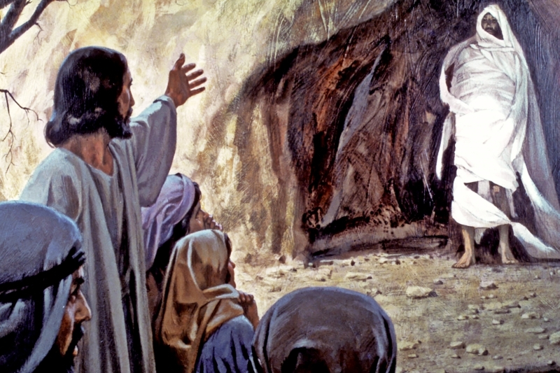

##經文：約翰福音十一章28-44節

28. 馬大說了這話，就回去暗暗的叫他妹子馬利亞，說：夫子來了，叫你。
29. 馬利亞聽見了，就急忙起來，到耶穌那裡去。
30. 那時，耶穌還沒有進村子，仍在馬大迎接他的地方。
31. 那些同馬利亞在家裡安慰他的猶太人，見他急忙起來出去，就跟著他，以為他要往墳墓那裡去哭。
32. 馬利亞到了耶穌那裡，看見他，就俯伏在他腳前，說：主啊，你若早在這裡，我兄弟必不死。
33. 耶穌看見他哭，並看見與他同來的猶太人也哭，就心裡悲歎，又甚憂愁，
34. 便說：你們把他安放在哪裡？他們回答說：請主來看。
35. 耶穌哭了。
36. 猶太人就說：你看他愛這人是何等懇切。
37. 其中有人說：他既然開了瞎子的眼睛，豈不能叫這人不死嗎？
38. 耶穌又心裡悲歎，來到墳墓前；那墳墓是個洞，有一塊石頭擋著。
39. 耶穌說：你們把石頭挪開。那死人的姊姊馬大對他說：主啊，他現在必是臭了，因為他死了已經四天了。
40. 耶穌說：我不是對你說過，你若信，就必看見神的榮耀嗎？
41. 他們就把石頭挪開。耶穌舉目望天，說：父啊，我感謝你，因為你已經聽我。
42. 我也知道你常聽我，但我說這話是為周圍站著的眾人，叫他們信是你差了我來。
43. 說了這話，就大聲呼叫說：拉撒路出來！
44. 那死人就出來了，手腳裹著布，臉上包著手巾。耶穌對他們說，解開，叫他走！

### 小組討論：
 1. 請閱讀約翰福音11：1-44，哪些經文會讓人覺得耶穌似乎不愛拉撒路？這讓我們學習了什麼功課？
 2. 哪些經文讓我們發現耶穌對拉撒路一家有他的美意和計劃？這讓我們學習了什麼功課？
 3. 在傷痛中，我們如何能夠持續的對神有信心？請分享你在困難中的經歷。

