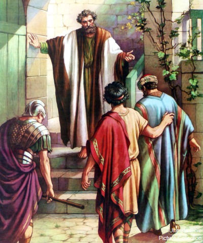

##經文：使徒行傳十章34-44節

34. 彼得就開口說：我真看出神是不偏待人。
35. 原來，各國中那敬畏主、行義的人都為主所悅納。
36. 神藉著耶穌基督（他是萬有的主）傳和平的福音，將這道賜給以色列人。
37. 這話在約翰宣傳洗禮以後，從加利利起，傳遍了猶太。
38. 神怎樣以聖靈和能力膏拿撒勒人耶穌，這都是你們知道的。他周流四方，行善事，醫好凡被魔鬼壓制的人，因為神與他同在。
39. 他在猶太人之地，並耶路撒冷所行的一切事，有我們作見證。他們竟把他掛在木頭上殺了。
40. 第三日，神叫他復活，顯現出來；
41. 不是顯現給眾人看，乃是顯現給神預先所揀選為他作見證的人看，就是我們這些在他從死裡復活以後和他同吃同喝的人。
42. 他吩咐我們傳道給眾人，證明他是神所立定的，要作審判活人、死人的主。
43. 眾先知也為他作見證說：凡信他的人必因他的名得蒙赦罪。
44. 彼得還說這話的時候，聖靈降在一切聽道的人身上。

> 大綱：
>1. 神悅納的人
>2. 救贖的事工
>3. 聖靈的澆灌

### 小組討論：
 1. 聖經中神喜悅的人有哪些特質？
 2. 你會怎樣向別人介紹耶穌基督？
 3. 為什麼基督徒需要聖靈的充滿？

