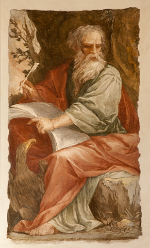

##經文：約翰一書五章13-20節

13. 我將這些話寫給你們信奉神兒子之名的人，要叫你們知道自己有永生。
14. 我們若照他的旨意求什麼，他就聽我們，這是我們向他所存坦然無懼的心。
15. 既然知道他聽我們一切所求的，就知道我們所求於他的，無不得著。
16. 人若看見弟兄犯了不至於死的罪，就當為他祈求，神必將生命賜給他；有至於死的罪，我不說當為這罪祈求。
17. 凡不義的事都是罪，也有不至於死的罪。
18. 我們知道凡從神生的，必不犯罪，從神生的，必保守自己（有古卷作：那從神生的必保護他），那惡者也就無法害他。
19. 我們知道，我們是屬神的，全世界都臥在那惡者手下。
20. 我們也知道，神的兒子已經來到，且將智慧賜給我們，使我們認識那位真實的，我們也在那位真實的裡面，就是在他兒子耶穌基督裡面。這是真神，也是永生。

> 大綱：
>1. 知道他聽我們一切所求的
>2. 當為犯罪的弟兄祈求
>3. 在基督裡的恩賜

### 小組討論：
 1. 你知道已經得救了嗎？你何以有此把握？
 2. 聖靈如何為你的生命帶來翻轉？
 3. 聖經中有哪些教導（價值）是和世俗相悖逆的？

