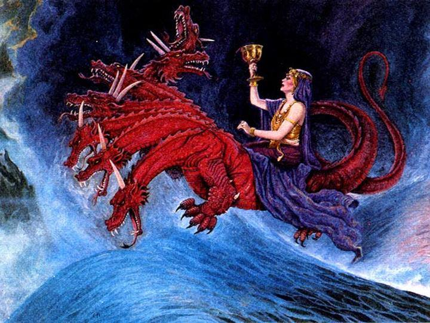

##經文：啟示錄十七章1-6,14-18節

1. 拿著七碗的七位天使中，有一位前來對我說：你到這裡來，我將坐在眾水上的大淫婦所要受的刑罰指給你看。
2. 地上的君王與他行淫，住在地上的人喝醉了他淫亂的酒。
3. 我被聖靈感動，天使帶我到曠野去，我就看見一個女人騎在朱紅色的獸上；那獸有七頭十角，遍體有褻瀆的名號。
4. 那女人穿著紫色和朱紅色的衣服，用金子、寶石、珍珠為妝飾；手拿金杯，杯中盛滿了可憎之物，就是他淫亂的污穢。
5. 在他額上有名寫著說：奧祕哉！大巴比倫，作世上的淫婦和一切可憎之物的母。
6. 我又看見那女人喝醉了聖徒的血和為耶穌作見證之人的血。我看見他，就大大的希奇。
7. 天使對我說：你為什麼希奇呢？我要將這女人和馱著他的那七頭十角獸的奧祕告訴你。
8. 你所看見的獸，先前有，如今沒有，將要從無底坑裡上來，又要歸於沉淪。凡住在地上、名字從創世以來沒有記在生命冊上的，見先前有、如今沒有、以後再有的獸，就必希奇。
9. 智慧的心在此可以思想。那七頭就是女人所坐的七座山，
10. 又是七位王；五位已經傾倒了，一位還在，一位還沒有來到；他來的時候，必須暫時存留。
11. 那先前有如今沒有的獸，就是第八位；他也和那七位同列，並且歸於沉淪。
12. 你所看見的那十角就是十王；他們還沒有得國，但他們一時之間要和獸同得權柄，與王一樣。
13. 他們同心合意將自己的能力、權柄給那獸。
14. 他們與羔羊爭戰，羔羊必勝過他們，因為羔羊是萬主之主、萬王之王。同著羔羊的，就是蒙召、被選、有忠心的，也必得勝。
15. 天使又對我說，你所看見那淫婦坐的眾水，就是多民、多人、多國、多方。
16. 你所看見的那十角與獸必恨這淫婦，使他冷落赤身，又要吃他的肉，用火將他燒盡。
17. 因為神使諸王同心合意，遵行他的旨意，把自己的國給那獸，直等到神的話都應驗了。
18. 你所看見的那女人就是管轄地上眾王的大城。

##啟示錄十八章7-10節

7. 他怎樣榮耀自己，怎樣奢華，也當叫他照樣痛苦悲哀，因他心裡說：我坐了皇后的位，並不是寡婦，決不至於悲哀。
8. 所以在一天之內，他的災殃要一齊來到，就是死亡、悲哀、饑荒。他又要被火燒盡了，因為審判他的主神大有能力。
9. 地上的君王，素來與他行淫、一同奢華的，看見燒他的煙，就必為他哭泣哀號。
10. 因怕他的痛苦，就遠遠的站著說：哀哉！哀哉！巴比倫大城，堅固的城啊，一時之間你的刑罰就來到了。

> 大綱：
>1. 人造之城的笙歌
>2. 人造之城的哀歌
>3. 上帝之城的凱歌

### 小組討論：
 1. 聖經內的人造之城,你對哪一個城印象深刻,為什麼 ?
 2. 你對上帝之城-新耶路撒冷城有何了解? 與你有何關係?

