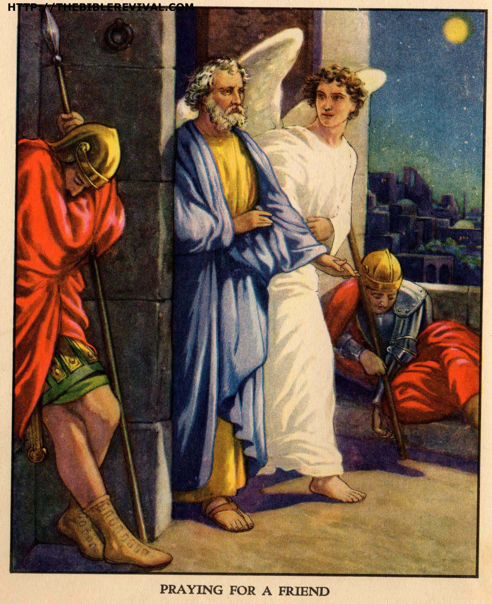

##經文：使徒行傳十二章1-16

1. 那時，希律王下手苦害教會中幾個人，
2. 用刀殺了約翰的哥哥雅各。
3. 他見猶太人喜歡這事，又去捉拿彼得。那時正是除酵的日子。
4. 希律拿了彼得，收在監裡，交付四班兵丁看守，每班四個人，意思要在逾越節後把他提出來，當著百姓辦他。
5. 於是彼得被囚在監裡；教會卻為他切切的禱告神。
6. 希律將要提他出來的前一夜，彼得被兩條鐵鍊鎖著，睡在兩個兵丁當中；看守的人也在門外看守。
7. 忽然，有主的一個使者站在旁邊，屋裡有光照耀，天使拍彼得的肋旁，拍醒了他，說：快快起來！那鐵鍊就從他手上脫落下來。
8. 天使對他說：束上帶子，穿上鞋。他就那樣做。天使又說：披上外衣，跟著我來。
9. 彼得就出來跟著他，不知道天使所做是真的，只當見了異象。
10. 過了第一層第二層監牢，就來到臨街的鐵門，那門自己開了。他們出來，走過一條街，天使便離開他去了。
11. 彼得醒悟過來，說：我現在真知道主差遣他的使者，救我脫離希律的手和猶太百姓一切所盼望的。
12. 想了一想，就往那稱呼馬可的約翰、他母親馬利亞家去，在那裡有好些人聚集禱告。
13. 彼得敲外門，有一個使女，名叫羅大，出來探聽，
14. 聽得是彼得的聲音，就歡喜的顧不得開門，跑進去告訴眾人說：彼得站在門外。
15. 他們說：你是瘋了！使女極力的說：真是他！他們說：必是他的天使！
16. 彼得不住的敲門。他們開了門，看見他，就甚驚奇。

> 大綱：
>1. 為什麼要禱告？
>2. 禱告是參與
>3. 信心是關鍵

### 小組討論：
 1. 怎樣的禱告會蒙神垂聽？
 2. 為什麼我們需要鼓勵大家參加禱告會？
 3. 禱告帶來怎樣的果效？請舉例說明。

