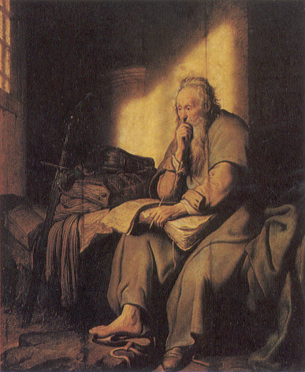

##經文：以弗所書一章3-14 節

3. 願頌讚歸與我們主耶穌基督的父神！他在基督裡曾賜給我們天上各樣屬靈的福氣：
4. 就如神從創立世界以前，在基督裡揀選了我們，使我們在他面前成為聖潔，無有瑕疵；
5. 又因愛我們，就按著自己意旨所喜悅的，預定我們藉著耶穌基督得兒子的名分，
6. 使他榮耀的恩典得著稱讚；這恩典是他在愛子裡所賜給我們的。
7. 我們藉這愛子的血得蒙救贖，過犯得以赦免，乃是照他豐富的恩典。
8. 這恩典是神用諸般智慧聰明，充充足足賞給我們的；
9. 都是照他自己所預定的美意，叫我們知道他旨意的奧祕，
10. 要照所安排的，在日期滿足的時候，使天上、地上、一切所有的都在基督裡面同歸於一。
11. 我們也在他裡面得（或作：成）了基業；這原是那位隨己意行、做萬事的，照著他旨意所預定的，
12. 叫他的榮耀從我們這首先在基督裡有盼望的人可以得著稱讚。
13. 你們既聽見真理的道，就是那叫你們得救的福音，也信了基督，既然信他，就受了所應許的聖靈為印記。
14. 這聖靈是我們得基業的憑據（原文作：質），直等到神之民（原文作：產業）被贖，使他的榮耀得著稱讚。

> 大綱：
>1. 蒙聖父的揀選：成為聖潔
>2. 蒙聖子的救贖：得兒子的名分
>3. 蒙聖靈的保證：受印記為憑據

### 小組討論：
 1. 「揀選」有何意義？神在什麼時候，什麼地方揀選我們？有什麼目的？
 2. 作神兒女與得兒子名分有什麼分別？試解釋「救贖」和「赦免」的意義。
 3. 請分享你認識聖靈有多少？v.13-14論到聖靈與信徒之間有哪些關係？

