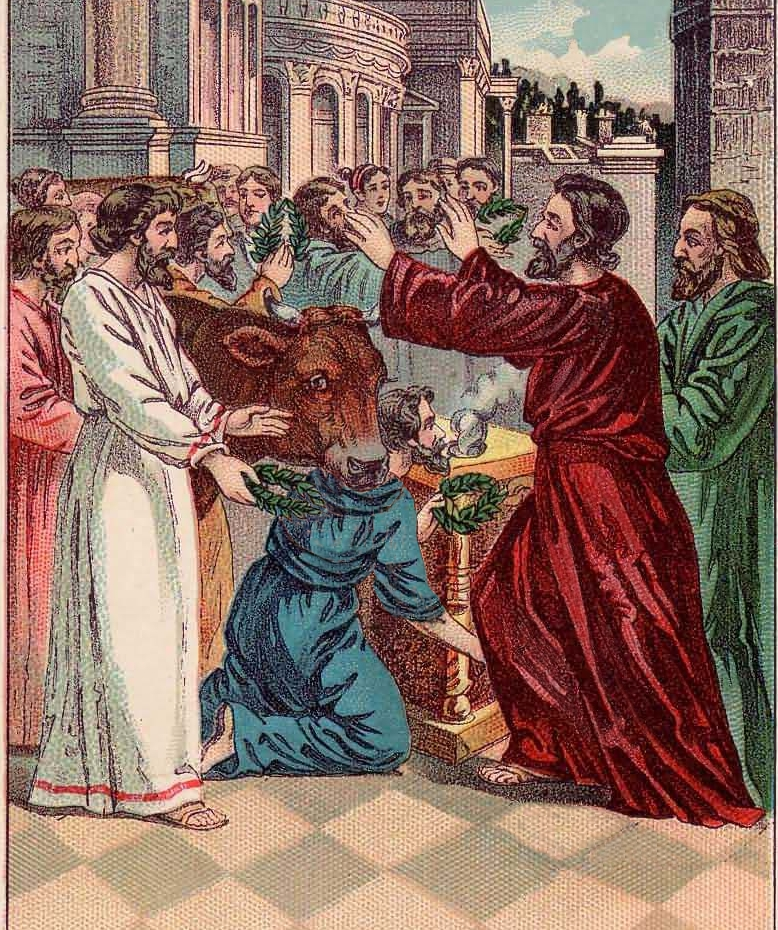

##經文：使徒行傳十四章 19-28

19. 但有些猶太人從安提阿和以哥念來，挑唆眾人，就用石頭打保羅，以為他是死了，便拖到城外。
20. 門徒正圍著他，他就起來，走進城去。第二天，同巴拿巴往特庇去，
21. 對那城裡的人傳了福音，使好些人作門徒，就回路司得、以哥念、安提阿去，
22. 堅固門徒的心，勸他們恆守所信的道；又說：我們進入神的國，必須經歷許多艱難。
23. 二人在各教會中選立了長老，又禁食禱告，就把他們交託所信的主。
24. 二人經過彼西底，來到旁非利亞。
25. 在別加講了道，就下亞大利去，
26. 從那裡坐船，往安提阿去。當初，他們被眾人所託、蒙神之恩，要辦現在所做之工，就是在這地方。
27. 到了那裡，聚集了會眾，就述說神藉他們所行的一切事，並神怎樣為外邦人開了信道的門。
28. 二人就在那裡同門徒住了多日。

> 大綱：
>1. 置死生於度外
>2. 堅固拓展教會
>3. 回饋母會支持

### 小組討論：
 1. 什麼是使徒保羅勇於向前的動力？
 2. 拓展教會事工的規劃有哪些值得參考的方針？
 3. 服事中遭遇艱難，仍然有喜樂，其來源是什麼?

