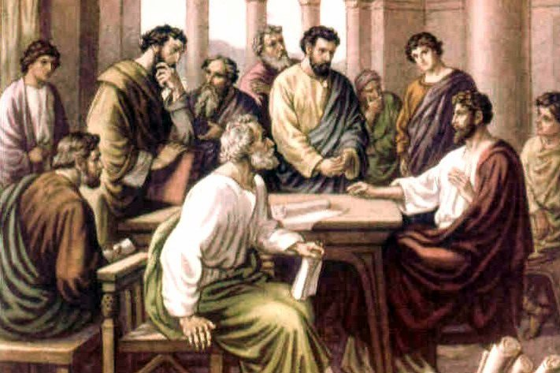

##經文：使徒行傳十五章 6-12節

6. 使徒和長老聚會商議這事；
7. 辯論已經多了，彼得就起來，說：諸位弟兄，你們知道神早已在你們中間揀選了我，叫外邦人從我口中得聽福音之道，而且相信。
8. 知道人心的神也為他們作了見證，賜聖靈給他們，正如給我們一樣；
9. 又藉著信潔淨了他們的心，並不分他們我們。
10. 現在為什麼試探神，要把我們祖宗和我們所不能負的軛放在門徒的頸項上呢？
11. 我們得救乃是因主耶穌的恩，和他們一樣，這是我們所信的。
12. 眾人都默默無聲，聽巴拿巴和保羅述說神藉他們在外邦人中所行的神蹟奇事。

> 大綱：
>1. 傳道的權柄
>2. 得救的憑證
>3. 和他們一樣

