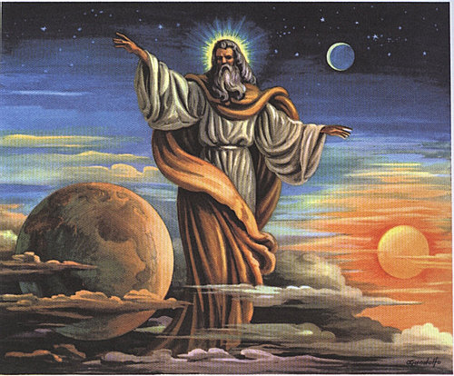

##經文：創世紀一章 26-31節

26. 神說：我們要照著我們的形像、按著我們的樣式造人，使他們管理海裡的魚、空中的鳥、地上的牲畜，和全地，並地上所爬的一切昆蟲。
27. 神就照著自己的形像造人，乃是照著他的形像造男造女。
28. 神就賜福給他們，又對他們說：要生養眾多，遍滿地面，治理這地，也要管理海裡的魚、空中的鳥，和地上各樣行動的活物。
29. 神說：看哪，我將遍地上一切結種子的菜蔬和一切樹上所結有核的果子全賜給你們作食物。
30. 至於地上的走獸和空中的飛鳥，並各樣爬在地上有生命的物，我將青草賜給他們作食物。事就這樣成了。
31. 神看著一切所造的都甚好。有晚上，有早晨，是第六日。

> 大綱：
>1. 上帝最奇妙的做工是創造了人的生命
>2. 因著上帝設計的完美無缺，我們能夠體驗到生命過程的奇妙無比
>3. 人在生長過程中任何時間都不可背離上帝
>4. 有幸成為人類中的一員應該內心充滿感恩，有信仰的人生處處體現著神的美意。

