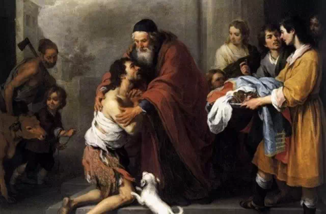

##經文：路加福音15章 11-32節

11. 耶穌又說：一個人有兩個兒子。
12. 小兒子對父親說：父親，請你把我應得的家業分給我。他父親就把產業分給他們。
13. 過了不多幾日，小兒子就把他一切所有的都收拾起來，往遠方去了。在那裡任意放蕩，浪費資財。
14. 既耗盡了一切所有的，又遇著那地方大遭饑荒，就窮苦起來。
15. 於是去投靠那地方的一個人；那人打發他到田裡去放豬。
16. 他恨不得拿豬所吃的豆莢充飢，也沒有人給他。
17. 他醒悟過來，就說：我父親有多少的雇工，口糧有餘，我倒在這裡餓死嗎？
18. 我要起來，到我父親那裡去，向他說：父親！我得罪了天，又得罪了你；
19. 從今以後，我不配稱為你的兒子，把我當作一個雇工吧！
20. 於是起來，往他父親那裡去。相離還遠，他父親看見，就動了慈心，跑去抱著他的頸項，連連與他親嘴。
21. 兒子說：父親！我得罪了天，又得罪了你；從今以後，我不配稱為你的兒子。
22. 父親卻吩咐僕人說：把那上好的袍子快拿出來給他穿；把戒指戴在他指頭上；把鞋穿在他腳上；
23. 把那肥牛犢牽來宰了，我們可以吃喝快樂；
24. 因為我這個兒子是死而復活，失而又得的。他們就快樂起來。
25. 那時，大兒子正在田裡。他回來，離家不遠，聽見作樂跳舞的聲音，
26. 便叫過一個僕人來，問是什麼事。
27. 僕人說：你兄弟來了；你父親因為得他無災無病的回來，把肥牛犢宰了。
28. 大兒子卻生氣，不肯進去；他父親就出來勸他。
29. 他對父親說：我服事你這多年，從來沒有違背過你的命，你並沒有給我一隻山羊羔，叫我和朋友一同快樂。
30. 但你這個兒子和娼妓吞盡了你的產業，他一來了，你倒為他宰了肥牛犢。
31. 父親對他說：兒啊！你常和我同在，我一切所有的都是你的；
32. 只是你這個兄弟是死而復活、失而又得的，所以我們理當歡喜快樂。

> 大綱：
>1. 失落的小兒子
>2. 失落的大兒子
>3. 真正的大兒子

