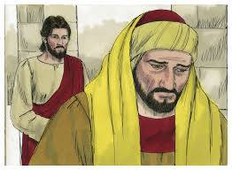

##經文：馬可福音10章 17-22節

17. 耶穌出來行路的時候，有一個人跑來，跪在他面前，問他說：良善的夫子，我當做什麼事才可以承受永生？
18. 耶穌對他說：你為什麼稱我是良善的？除了神一位之外，再沒有良善的。
19. 誡命你是曉得的：不可殺人；不可姦淫；不可偷盜；不可作假見證；不可虧負人；當孝敬父母。
20. 他對耶穌說：夫子，這一切我從小都遵守了。
21. 耶穌看著他，就愛他，對他說：你還缺少一件：去變賣你所有的，分給窮人，就必有財寶在天上；你還要來跟從我。
22. 他聽見這話，臉上就變了色，憂憂愁愁的走了，因為他的產業很多。

> 大綱：
>1. 財主要永生?
>2. 對救恩的假設
>3. 耶穌的要求

