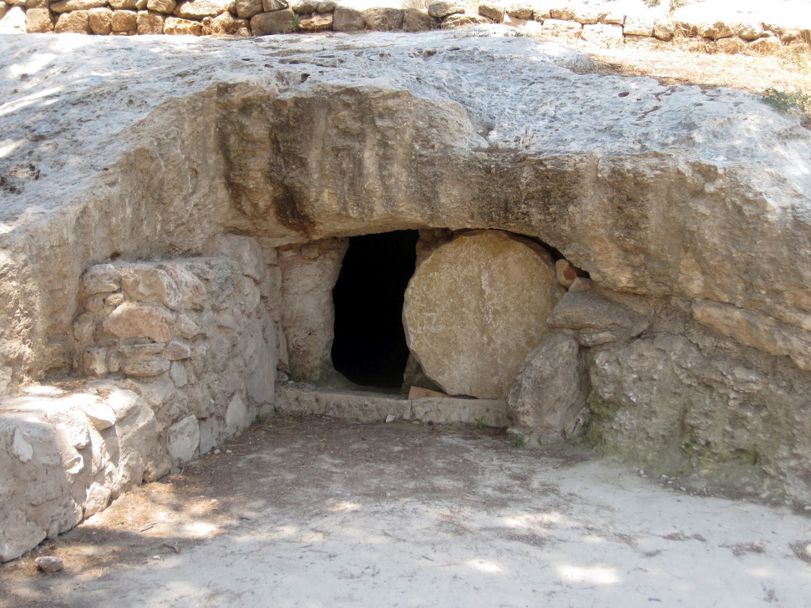

##經文：路加福音24章 1-12節

1. 七日的頭一日，黎明的時候，那些婦女帶著所預備的香料來到墳墓前，
2. 看見石頭已經從墳墓滾開了，
3. 他們就進去，只是不見主耶穌的身體。
4. 正在猜疑之間，忽然有兩個人站在旁邊，衣服放光。
5. 婦女們驚怕，將臉伏地。那兩個人就對他們說：為什麼在死人中找活人呢？
6. 他不在這裡，已經復活了。當記念他還在加利利的時候怎樣告訴你們，
7. 說：人子必須被交在罪人手裡，釘在十字架上，第三日復活。
8. 他們就想起耶穌的話來，
9. 便從墳墓那裡回去，把這一切事告訴十一個使徒和其餘的人。
10. 那告訴使徒的就是抹大拉的馬利亞和約亞拿，並雅各的母親馬利亞，還有與他們在一處的婦女。
11. 他們這些話，使徒以為是胡言，就不相信。
12. 彼得起來，跑到墳墓前，低頭往裡看，見細麻布獨在一處，就回去了，心裡希奇所成的事。

