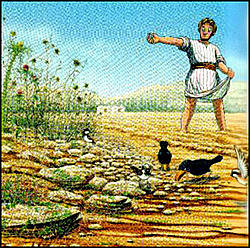

##經文：路加福音8章 4-15節

4. 當許多人聚集、又有人從各城裡出來見耶穌的時候，耶穌就用比喻說：
5. 有一個撒種的出去撒種。撒的時候，有落在路旁的，被人踐踏，天上的飛鳥又來吃盡了。
6. 有落在磐石上的，一出來就枯乾了，因為得不著滋潤。
7. 有落在荊棘裡的，荊棘一同生長，把他擠住了。
8. 又有落在好土裡的，生長起來，結實百倍。耶穌說了這些話，就大聲說：有耳可聽的，就應當聽！
9. 門徒問耶穌說：這比喻是什麼意思呢？
10. 他說：神國的奧祕只叫你們知道；至於別人，就用比喻，叫他們看也看不見，聽也聽不明。
11. 這比喻乃是這樣：種子就是神的道。
12. 那些在路旁的，就是人聽了道，隨後魔鬼來，從他們心裡把道奪去，恐怕他們信了得救。
13. 那些在磐石上的，就是人聽道，歡喜領受，但心中沒有根，不過暫時相信，及至遇見試煉就退後了。
14. 那落在荊棘裡的，就是人聽了道，走開以後，被今生的思慮、錢財、宴樂擠住了，便結不出成熟的子粒來。
15. 那落在好土裡的，就是人聽了道，持守在誠實善良的心裡，並且忍耐著結實。

> 大綱：
>1. 渴慕真道熱切追求
>2. 歡喜領受生根建造
>3. 順從聖靈拒絕誘惑
>4. 持守真道忍耐結實

