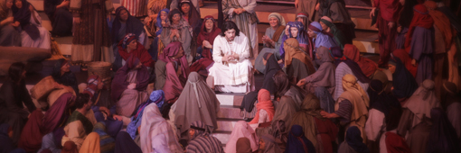

##經文：路加福音12章 22-32節

22. 耶穌又對門徒說：所以我告訴你們，不要為生命憂慮吃什麼，為身體憂慮穿什麼；
23. 因為生命勝於飲食，身體勝於衣裳。
24. 你想烏鴉，也不種也不收，又沒有倉又沒有庫，神尚且養活他。你們比飛鳥是何等的貴重呢！
25. 你們哪一個能用思慮使壽數多加一刻呢（或作：使身量多加一肘呢）？
26. 這最小的事，你們尚且不能做，為什麼還憂慮其餘的事呢？
27. 你想百合花怎麼長起來；他也不勞苦，也不紡線。然而我告訴你們，就是所羅門極榮華的時候，他所穿戴的，還不如這花一朵呢！
28. 你們這小信的人哪，野地裡的草今天還在，明天就丟在爐裡，神還給他這樣的妝飾，何況你們呢！
29. 你們不要求吃什麼，喝什麼，也不要掛心；
30. 這都是外邦人所求的。你們必須用這些東西，你們的父是知道的。
31. 你們只要求他的國，這些東西就必加給你們了。
32. 你們這小群，不要懼怕，因為你們的父樂意把國賜給你們。

> 大綱：
> 1. 放對優先次序
> 2. 憂慮沒有益處
> 3. 憂慮減弱信心

