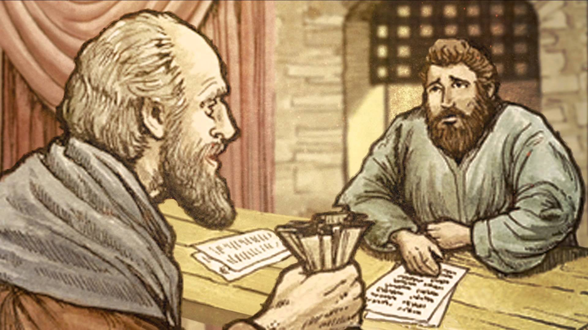

##經文：路加福音16章 1-13節

1. 耶穌又對門徒說：有一個財主的管家，別人向他主人告他浪費主人的財物。
2. 主人叫他來，對他說：我聽見你這事怎麼樣呢？把你所經管的交代明白，因你不能再作我的管家。
3. 那管家心裡說：主人辭我，不用我再作管家，我將來做什麼？鋤地呢？無力；討飯呢？怕羞。
4. 我知道怎麼行，好叫人在我不作管家之後，接我到他們家裡去。
5. 於是把欠他主人債的，一個一個的叫了來，問頭一個說：你欠我主人多少？
6. 他說：一百簍（每簍約五十斤）油。管家說：拿你的帳，快坐下，寫五十。
7. 又問一個說：你欠多少？他說：一百石麥子。管家說：拿你的帳，寫八十。
8. 主人就誇獎這不義的管家做事聰明。因為今世之子，在世事之上，較比光明之子更加聰明。
9. 我又告訴你們，要藉著那不義的錢財結交朋友，到了錢財無用的時候，他們可以接你們到永存的帳幕裡去。
10. 人在最小的事上忠心，在大事上也忠心；在最小的事上不義，在大事上也不義。
11. 倘若你們在不義的錢財上不忠心，誰還把那真實的錢財託付你們呢？
12. 倘若你們在別人的東西上不忠心，誰還把你們自己的東西給你們呢？
13. 一個僕人不能事奉兩個主；不是惡這個愛那個，就是重這個輕那個。你們不能又事奉神，又事奉瑪門。

> 大綱：
> 1. 精明面對困境
> 2. 善用貲財行善
> 3. 忠心儆醒事奉

